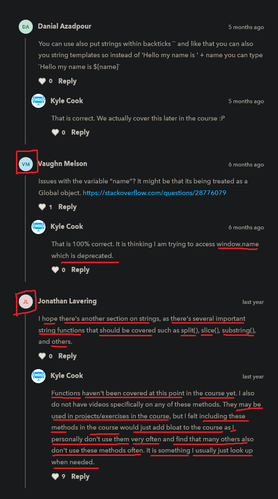

# string datatype

    - is a combination of multiple characters 
    - this datatype deals with a letter or text or number inside double or single quotes
    - defining double or single quotes means string 
    - in string , always 
        - indexing in string starts from 0 (zero)
        - length of a string starts from 1 (one) 

    - to use properties or methods of a string
        then we use dot operator

## example - of string

    - general example

    eg : 
        let a = "hello world"
        console.log(a)

    eg : of empty string

        let a = ""
        console.log(a)

        // output : we'll get nothing

        NOTE : 
            - don't put a single space 
                because if we put a single space in a string
                then means it will be counted and string will have the length

## example - of concatenation / combining two or more strings 

    - to concatenating two strings we use "+" plus arithmetic operator

    eg : 
        let a = "hello"
        let b = "world"

        console.log(a + b)

        // output : helloworld

        - here to give a space b/w two words then do this
        
        let a = "hello " , b = "world"
        console.log(a + b)
        // OR 
        let a = "hello" , b = "world"   
        console.log(a + " " + b)
            - here we add another string which contain a space

        // output : hello world

## example - of using double and single quotes simultaneously

    NOTE : 
        - if we used double quotes outside then use single quotes inside 
            and vice versa 
        - don't use double quotes outside and inside also then error will come
            and same with single quotes

    eg 1 : using double quotes outside and single quotes inside the double quotes and vice versa ✅ 

        let a = "he play 'football'" 
        // OR  
        let a = 'he play "soccer"' 

        - both ways are right ✅

        but don't use them like this

    eg 2 : using double quotes outside and inside also and with single quotes also ✅

        let a = 'he play 'football'' 
        // OR  
        let a = "he play "soccer"" 

        - both ways are wrong ❌
        - here comes the use case of escape sequence character 
            like this

        let a = 'he play \'soccer\' 
        // OR 
        let a = "he play \"soccer\"" 

        - then now both ways are right

    - we can use escape sequence character
        but example 1 is the better choice 💡

## example of typeof operator with string type

    eg :    
        let a = 'john says "Hi"'
        console.log(typeof a)

        // output : string
 

## challenge time - timeline 4:48

    ques : create a variable called name and give value to the variable
            then print the text "hello my name is" with the use of that variable
            to put our name into that text

    Ans :
            let name = "Teen"

            console.log("hello my name is " + name)

            // output : hello my name is Teen

## string methods and properties

    -> string methods ✅

        - these methods doesn't change the original string 
            they return a new string

        - at()
        - charAt()
        - charCodeAt()
        - concat()
        - endsWith()
        - fromCharCode()
        - includes()
        - indexOf()
        - lastIndexOf()
        - match()
        - matchAll()
        - repeat()
        - replace()
        - replaceAll()
        - search()
        - slice()
        - split()
        - startsWith()
        - substr()
        - substring()
        - toLowerCase() 🔥
        - toUpperCase() 🔥
        - trim() 🔥
          - trimStart() and trimEnd() -> not important 

        - padStart() & padEnd()
        - valueOf()

    -> string properties ✅

        - length

## discussion section

